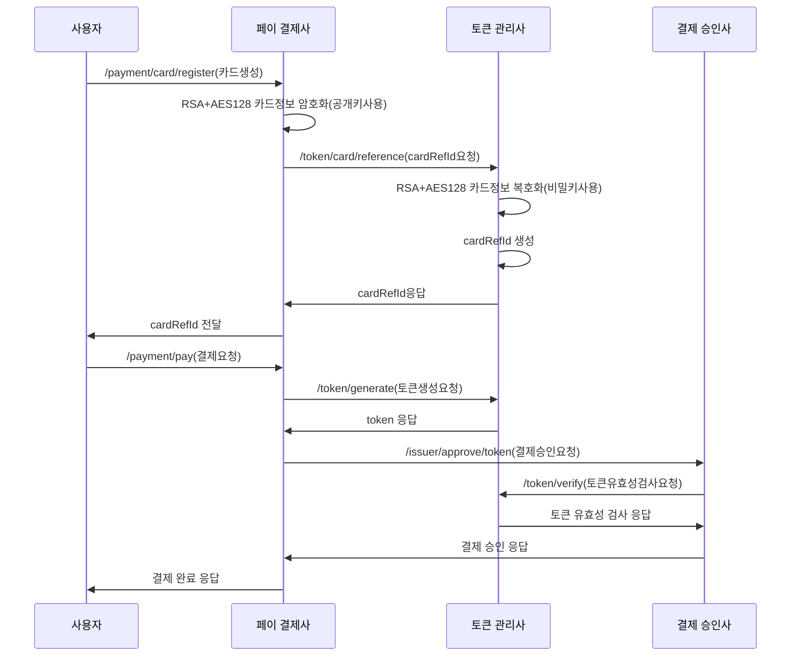
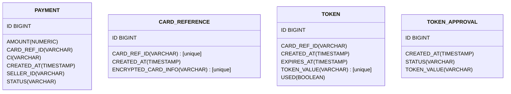

### spring docs(payment) : http://localhost:8000/swagger-ui/index.html#/

### spring docs(token) : http://localhost:8001/swagger-ui/index.html#/

### spring docs(issuer) : http://localhost:8002/swagger-ui/index.html#/

### payment list page : http://localhost:3000

## 시퀀스 다이어그램

## ERD

