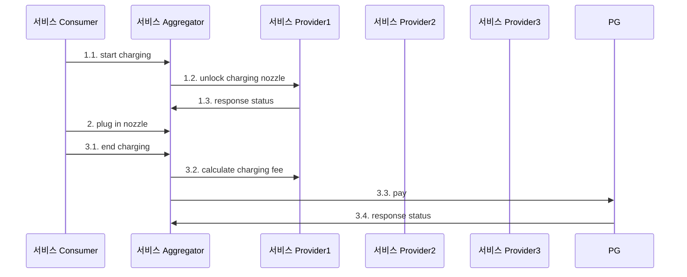

## 과제: 거래 중계(Aggregate) 인프라

### 업무 개요

- 여러 제휴사의 **충전 서비스**를 중계하는 인프라를 구축합니다.
- 시스템은 서비스 **Consumer**, **Aggregator**, **Provider**로 구성되며, 각 컴포넌트는 독립된 서버로 동작하고 REST API로 인터페이스합니다.
- 최소 3개의 서비스 Provider는 **서로 다른 통신 규격**과 **station/nozzle 관리 방식**을 사용합니다.
- Aggregator는 Consumer에 따라 자동으로 적절한 Provider를 선택합니다.
- 서비스 Consumer는 UI 또는 Postman으로 테스트가 가능합니다.

### 업무 요구사항

1. 충전 서비스 기반으로 구성
2. 결제 요청은 `결제 ID` 기준으로 진행
3. 최소 3개의 Provider 구성 (서로 다른 통신 방식 사용)
4. Aggregator는 Consumer에 따라 Provider 자동 선택
5. 프로세스 완성도를 위한 요소는 자유롭게 추가 가능

### 개발 요구사항

- **언어**: Java (JDK 17)
- **프레임워크**: Spring Framework
- **DB**: H2 Database (필요 시 변경 가능)

### 제출 항목

1. 시퀀스 다이어그램
2. ERD
3. 소스 코드
4. 데모 (필요 시 노트북 지참)
5. 백오피스 UI 설계서 (거래내역 조회용)

### 시퀀스 다이어그램 (Mermaid)

