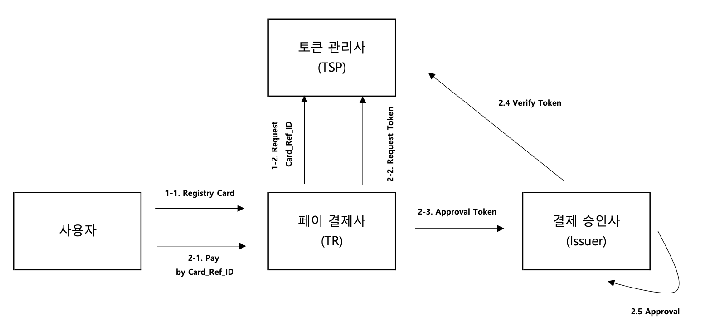

## 토근기반 결제 인프라

* 1회용 토큰 기반 결제 인프라를 구축하려 한다.
* 본 인프라는 결제카드를 사전에 등록하는 프로세스와 1회용 토큰을 이용한 결제단계로 구성되어 있다.
* 자세한 처리 프로세스는 아래 그림을 참조하여 구성한다.
* 페이 결제사, 토큰 관리사, 결제 승인사는 독립서버로 구성하고 API를 통해서 인터페이스를 한다.
* 사용자는 화면으로 구성하되 PostMan을 통해서 테스트를 구성해도 된다.

## 업무 요구사항

1. 사용자의 CI는 이미 습득을 했으며 사용자 식별키로 CI를 사용한다.
2. 카드정보는 페이 결제사에서 볼 수 없으며 암호화하여 토큰 관리사에 전달한다.
3. 결제과정에서는 카드정보를 사용하지 않는다.
4. 모든 거래는 rest API 기반으로 설계한다.
5. 제시된 내용외에 프로세스 완성도를 위한 필요한 요소는 추가가 가능하다.

## 개발 요구사항

1. 언어는 JAVA(JDK17)를 사용한다.
2. 개발 프레임웍은 스프링을 활용한다.
3. DB는 H2를 활용한다(필요시 다른 DB사용 가능)

## 제출 사항

1. 시컨스 다이어그램
2. ERD
3. 소스
4. 데모 (필요시 노트북 지참)
5. 백오피스 UI 설계서 (거래내역조회)
