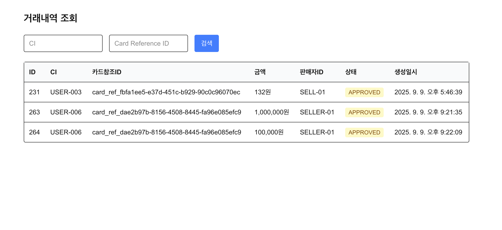
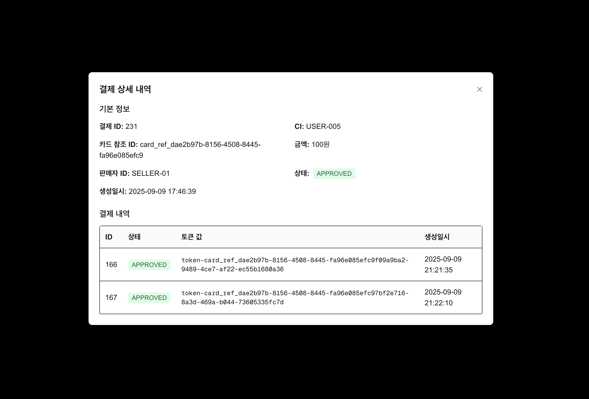

# 거래내역조회 UI 설계

## 1. 거래내역 조회 화면 설계

### 1.1 조회 목록 화면 구성



### 1.2 상세 조회 팝업



## 2. API 엔드포인트 설계

### 2.1 거래내역 조회 API

```http
GET /view/payments
```

**요청(Query Parameter)**

| 이름          | 타입     | 필수 여부 | 설명          | 예시 값                                            |
|-------------|--------|-------|-------------|-------------------------------------------------|
| `ci`        | string | 선택    | customer id | `USER-001`                                      |
| `cardRefId` | string | 선택    | 카드 구분 id    | `card_ref_dae2b97b-8156-4508-8445-fa96e085efc9` |

**응답(예시)**

```json
{
  "content": [
    {
      "id": 231,
      "ci": "USER-001",
      "cardRefId": "card_ref_dae2b97b-8156-4508-8445-fa96e085efc9",
      "amount": 100.00,
      "sellerId": "SELLER-01",
      "status": "APPROVED",
      "createdAt": "2025-09-09 17:46:39"
    }
  ],
  "pageable": {
    "pageNumber": 0,
    "pageSize": 20,
    "sort": {
      "empty": true,
      "unsorted": true,
      "sorted": false
    },
    "offset": 0,
    "paged": true,
    "unpaged": false
  },
  "last": true,
  "totalPages": 1,
  "totalElements": 3,
  "first": true,
  "size": 20,
  "number": 0,
  "sort": {
    "empty": true,
    "unsorted": true,
    "sorted": false
  },
  "numberOfElements": 3,
  "empty": false
}
```

### 2.2 거래 상세 조회 API

```http
GET /view/payments/{paymentId}/detail
```

**응답(예시)**

```json
{
  "id": 231,
  "ci": "USER-005",
  "cardRefId": "card_ref_dae2b97b-8156-4508-8445-fa96e085efc9",
  "amount": 100.00,
  "sellerId": "SELLER-01",
  "status": "APPROVED",
  "createdAt": "2025-09-09 17:46:39",
  "payList": [
    {
      "id": 166,
      "status": "APPROVED",
      "tokenValue": "token-card_ref_dae2b97b-8156-4508-8445-fa96e085efc9f09a9ba2-9489-4ce7-af22-ec55b1680a36",
      "createdAt": "2025-09-09 21:21:35"
    },
    {
      "id": 167,
      "status": "APPROVED",
      "tokenValue": "token-card_ref_dae2b97b-8156-4508-8445-fa96e085efc97bf2e716-8a3d-469a-b044-73605335fc7d",
      "createdAt": "2025-09-09 21:22:10"
    }
  ]
}
```

